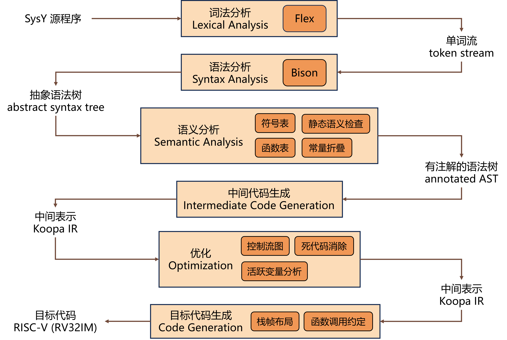
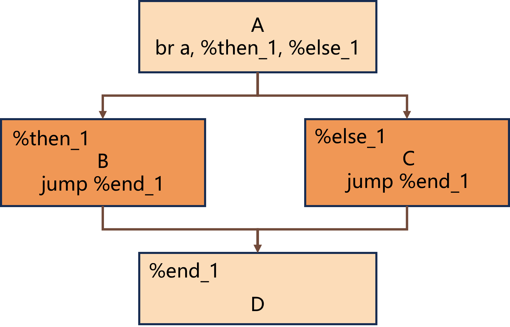
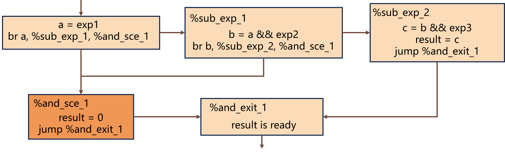
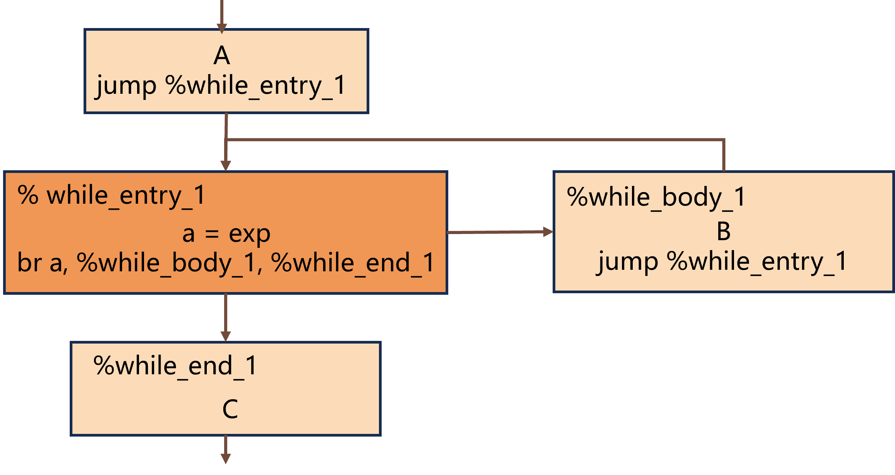
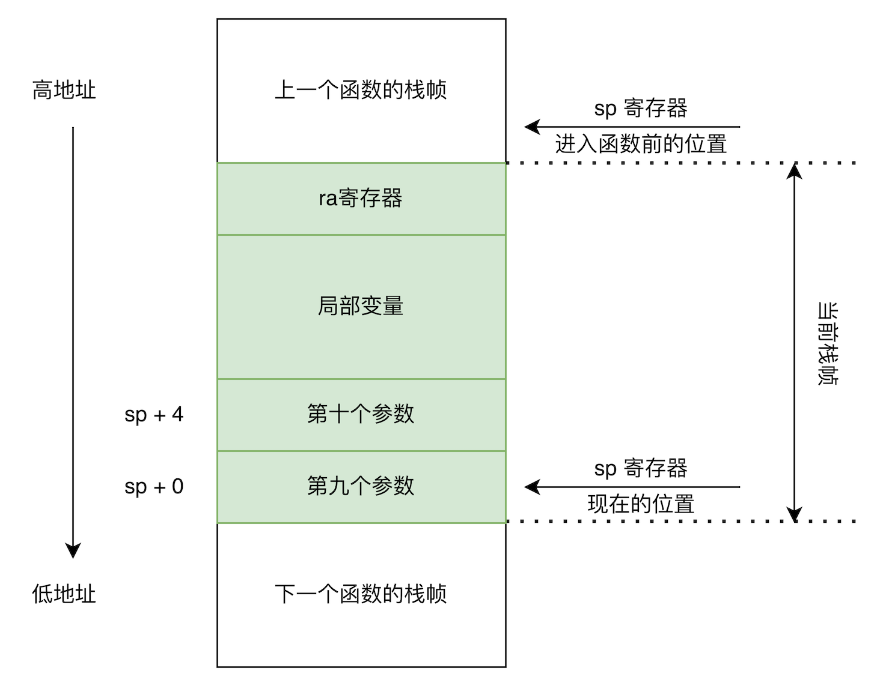

# PKU 编译实践报告
## 一、编译器概述
### 1.1 基本功能
本编译器在[北大编译实践在线文档](https://pku-minic.github.io/online-doc/#/)指导下完成，能够将 SysY 源程序转换为 32 位 RISC-V 汇编代码 (RV32IM)，其功能包括了编译流程的各个阶段：
* **语言特性支持**：支持 SysY 语言**除 float 外的全部特性**，包括表达式、常量变量声明、语句块和作用域、if-else 分支、函数定义与调用、数组等，并额外增加了**函数声明**。
* **独立的语义分析阶段**：通过遍历 AST ，建立**多层符号表**、**函数表**，实现了**常量折叠**，能够**静态检测**并报告各类语义错误。
* **中间代码生成**：使用了文档设计的中间表示 Koopa IR，通过 **Visitor 模式**遍历 AST 生成。
* **优化**：实现了两种 IR 级优化——**死代码块消除**和基于**活跃变量分析**的**死代码消除**，能有效去除无用代码。
* **目标代码生成**：能够将 Koopa IR 翻译成 RISC-V 汇编 (范围是 RV32IM)，具备**栈帧管理**、**调用约定处理**等功能。

在工程实现上，本项目采用 C++ 编写全部模块，使用 flex/bison 构造词法与语法分析前端，通过 Makefile 管理编译流程、git 管理版本。

### 1.2 项目结构
采用经典的流水线式架构，共 6 个模块，各司其职：


项目目录如下：
```sh
baby-compiler
|-- Makefile
`-- src # 源代码
    |-- sysy.l # flex 词法规则 -> 词法分析器
    |-- sysy.y # bison 语法规则 -> 语法分析
    |-- parser.hpp # 定义 AST 节点类
    |-- sema.cpp # 语义分析模块
    |-- sema.hpp
    |-- koopa.cpp # IR 生成模块
    |-- koopa.hpp
    |-- optimizer # IR 优化模块
    |   |-- control_flow_graph.cpp # 控制流图
    |   |-- control_flow_graph.hpp
    |   |-- dead_block_elim.cpp # 死代码块消除
    |   |-- dead_block_elim.hpp
    |   |-- dead_code_elim.cpp # 死代码消除
    |   |-- dead_code_elim.hpp
    |   |-- optimizer.cpp # 对外接口
    |   `-- optimizer.hpp
    |-- riscv.cpp # 目标代码生成模块
    |-- riscv.hpp
    `-- main.cpp # 主程序，串联各阶段
```

### 1.3 测试与验证
本编译器的正确性通过实践课程提供的测试用例集进行验证，共 130 个测试用例，验证了 IR 生成、优化和目标代码生成的正确性。

此外，我自己编写了语义分析阶段的错误检测用例，用于验证各类语义错误能否被正确识别并给出准确的报错信息。

### 1.4 使用说明
环境要求：
* C++17 及以上编译器
* flex 与 bison (用于生成词法与语法分析器)
* GNU Make (用于构建)

然后直接在项目根目录下 `make` 编译，运行得到的 `./build/compiler` 即可。

由 SysY 源代码生成 Koopa IR：
```sh
./build/compiler -koopa 输入文件 -o 输出文件
```

由 SysY 源代码生成 RISC-V：
```sh
./build/compiler -riscv 输入文件 -o 输出文件
```

也是生成 RISC-V ，为性能测试加的：
```sh
./build/compiler -perf 输入文件 -o 输出文件
```

## 二、设计与设计考虑
首先介绍下存储抽象语法树 (syntax tree, AST) 和中间表示 (intermediate representation, IR) 的核心数据结构，以及我在接口设计中选择的方案。
### 2.1 AST 节点类
这里按照语法规则，为右侧的每个规则定义了一个 AST 节点类，所有节点类继承自同一个抽象基类 `BaseAST`，每个节点类存有终结符信息或其他节点的指针。

在语法分析中，各个节点随着规则的展开被新建并连接，最终得到一棵以开始符 `CompUnitAST` 为根节点的抽象语法树。而语义分析和 IR 生成都是靠遍历这棵树的节点来工作的。

以下面常量定义规则为例
```text
ConstDef ::= IDENT "=" ConstInitVal
           | IDENT ConstSizeList "=" ConstInitVal;
```
那就定义两个节点类，分别对应右侧两种规则。
```cpp
class ConstDefAST_1 : public BaseAST {
  public:
    std::string ident; // 终结符 IDENT 的信息
    std::unique_ptr<BaseAST> constinitval; // 指向子节点的指针
    // ...
};
class ConstDefAST_2 : public BaseAST {
  public:
    std::string ident;
    std::unique_ptr<BaseAST> constsizelist;
    std::unique_ptr<BaseAST> constinitval;
    // ...
}
```
可以看到使用了智能指针 `unique_ptr`，它可以自动释放内存，省下内存管理的负担。

### 2.2 IR 数据结构
我为 Koopa IR 设计了专门的数据结构，在 IR 生成阶段，会遍历 AST 建立 IR 的数据结构，而不是直接输出 IR 文本，有两点原因：
* 便于在目标代码生成阶段遍历 IR 内容
* 便于执行 IR 优化

与 AST 的树状结构不同，IR 更接近线性结构，设计如下：
* `Program` 整个 IR 程序
    * 全局量列表，含若干 `Global`
        * `Global` 1
        * `Global` 2
        * ...
    * 函数列表，含若干函数声明 `FunctionDecl` 和定义 `Function`
        * `FunctionDecl` 1
        * `Function` 2
            * 基本块列表，含若干基本块 `BasicBlock`
                * `BasicBlock` 1
                    * 指令列表，含若干指令 `Value`
                        * `Value` 1
                        * `Value` 2
                        * ...
                * `BasicBlock` 2
                * ...
        * ...

部分代码如下：
```cpp
class ProgramIR : public BaseIR { // 整个 IR
  public:
    std::vector<BaseIR*> globals; // 全局量列表
    std::vector<BaseIR*> functions; // 函数列表
    // ...
};
class GlobalIR_1 : public BaseIR { // 全局变量
  public:
    std::string name; // 变量名
    std::string type; // 变量类型
    std::string init_val; // 变量初始化值
    // ...
};
class FunctionIR : public BaseIR { // 函数定义
  public:
    std::string name; // 函数名
    std::string function_type; // 返回值类型
    std::vector<std::string> parameters; // 参数名
    std::vector<int> param_dims; // 参数维度，用于处理数组参数
    // 数组参数各维度的大小
    std::unordered_map<int, std::vector<int>> param_sizes;
    std::vector<BaseIR*> basic_blocks; // 基本块
    // ...
};
// ...
```

### 2.3 Visitor 模式
语义分析、IR 生成、目标代码生成中，编译器都要执行遍历，每次遍历都要在 AST 或 IR 的每个节点处“做点什么”，这时面临两种选择：
* 在基类中定义“做点什么”的虚函数，由每个子类重写
* 采用 Visitor 模式，将“做点什么”外置到一个独立的 Visitor 类中

我选择了后者，理由如下：
* 前者存在依赖关系的倒置。以遍历 AST 生成 IR 为例，选择前者意味着 AST 内的函数实现依赖于 IR 的设计，但从编译流程看应该是 IR 依赖 AST、IR 从 AST 获取信息后按自己的结构生成。Visitor 模式可以纠正这个方向。
* 前者会导致 AST 模块功能太多，显得臃肿。

遍历 AST 进行语义分析、遍历 AST 生成 IR 以及遍历 IR 生成目标代码，均采用 Visitor 模式来设计接口，代码示例如下：
```cpp
// parser.hpp，AST 模块
class CompUnitAST : public BaseAST {
    // ...
    void accept(Visitor_ast& visitor) override {
        visitor.ir_init(*this);
    }
    // ...
};

// koopa.hpp，IR 生成模块
class Visitor_ast {
    // ...
    ProgramIR* program; // 存储状态信息的成员变量
    FunctionIR* function;
    BasicBlockIR* basic_block;
    // ...
    void ir_init(CompUnitAST& comp_unit); // 若干处理节点的函数
    void ir_init(CompUnitListAST& comp_unit_list);
    void ir_init(CompUnitItemAST_1& comp_unit_item);
    //...
};
```
从这里还可以看到 Visitor 模式的另一个优势：可以定义成员来存储遍历时的状态信息，便于在遍历多个节点时传递上下文。

## 三、前端设计与语义约束系统
### 3.1 词法分析
词法分析器由 flex 根据规则文件 `sysy.l` 生成。`sysy.l` 使用正则表达式定义了 SysY 中所有关键字、标识符、整数常量、运算符和分隔符的 token 模式，并过滤空白符与注释。

### 3.2 语法规则处理
语法分析器由 bison 根据 `sysy.y` 生成，不过这里不关注 `sysy.y` 的写法，而是讲讲在原有语法规则上遇到的问题和我所做的改进。改进后的完整 EBNF 规则位于附录 2.
#### 3.2.1 列表规则处理
bison 不能直接实现带有 `{...}` 的规则，需要转换成递归写法。

比如下面规则：
```text
Block         ::= "{" {BlockItem} "}";
BlockItem     ::= Decl | Stmt;
```
改写成：
```text
Block           ::= "{" BlockItemList "}";
BlockItemList   ::= %empty | BlockItemList BlockItem;
BlockItem       ::= Decl | Stmt;
```
这样 bison 就可以实现了，然后 AST 节点使用 `std::vector` 存放 `{...}` 结构：
```cpp
class BlockAST : public BaseAST {
    std::unique_ptr<BaseAST> blockitemlist;
    // ...
};
class BlockItemListAST : public BaseAST {
    std::vector<std::unique_ptr<BaseAST>> blockitems;
    //...
};
```

#### 3.2.2 空悬 else 二义性消除
经典语法二义性，当遇到类似 `if (x) if (y) a=1; else a=2;` 时，`else` 可与两个 `if` 中的任意一个匹配。
```text
Stmt ::= "if" "(" Exp ")" Stmt ["else" Stmt]
```

所以增加规定：else 必须和最近的 if 匹配。为达到这点，将 `Stmt` 分成不需要有 else 匹配的完整语句 `MatchedStmt`，和有未匹配 if 的 `UnmatchedStmt`，然后调整语法规则将 else 强制与距离最近的未匹配 if 匹配，消除二义性。
```text
Stmt          ::= MatchedStmt | UnmatchedStmt
MatchedStmt   ::= "if" "(" Exp ")" MatchedStmt "else" MatchedStmt 
UnmatchedStmt ::= "if" "(" Exp ")" Stmt 
                | "if" "(" Exp ")" MatchedStmt "else" UnmatchedStmt;
```

#### 3.2.3 另一处 shift-reduce 冲突解决
下面语法会导致语法分析器在面对 `int x...` 这样的结构时，无法判断要把 `int` 规约成 `BType` 还是 `FuncType`。
```text
BType   ::= "int";
FuncType::= "void" | "int";

VarDecl ::= BType VarDef {"," VarDef} ";";
FuncDef ::= FuncType IDENT "(" [FuncFParams] ")" Block;
```

解决方法很简单，将 `FuncType` 并入 `BType` 即可。
```text
BType   ::= "int" | "void";

VarDecl ::= BType VarDef {"," VarDef} ";";
FuncDef ::= BType IDENT "(" [FuncFParams] ")" Block;
```

### 3.3 语义分析
#### 3.3.1 语义分析类
语义分析由一个 Visitor 类完成，包含了处理各个 AST 节点的函数，并维护着语义分析所需的状态信息，如符号表、函数表。
```cpp
// sema.hpp
class Visitor_sema {
  private: // 状态信息
    // ...
    std::stack<ErrorMode> error_mode_stk; // 错误检测模式
    // ...
    bool if_fold = false; // 是否常量折叠
    // ...
    SymbolTableStack symbol_table_stack; // 多层符号表
    // ...
    FunctionTable func_def_table; // 函数定义表
    FunctionDeclTable func_decl_table; // 函数声明表
    // ...
  public: // 节点函数
    void sema_analysis(CompUnitAST& comp_unit);
    void sema_analysis(CompUnitListAST& comp_unit_list);
    void sema_analysis(CompUnitItemAST_1& comp_unit_item);
    // ...
};
```

#### 3.3.2 多层符号表与作用域管理
语义分析中使用多层符号表来管理变量、常量的可见性与生命周期，以实现作用域规则。

多层符号表的主体是 `std::vector<SymbolTable*>`，其中每个 `SymbolTable` 对应一个作用域，存储符号名与符号信息。

作用域管理的实现：
* **进入作用域**：进入新的语句块或函数体时，向顶部加入一层新的符号表，代表当前最内层的作用域。
* **符号声明**：遇到变量或常量声明时，注册到顶部的符号表中。由此，新声明的符号仅属于当前作用域。
* **符号查找**：查找一个标识符时，从顶向下逐层搜索，返回第一个匹配的符号。实现了内层符号会暂时隐藏外层同名符号的规则。
* **离开作用域**：退出时，将顶部符号表弹出，恢复外层的作用域。

此外，尽管 SysY 允许不同作用域中出现同名变量，后续的 IR 却要求每个变量拥有唯一的名称。所以，我们通过增加编号将每个变量的名称变成全局唯一并写入 AST，这样 IR 生成阶段就不用担心重名问题了。

以下面 SysY 程序为例：
```c
int a = 1;
int main() {
    int b;
    {
        int a = 2;
        int b;
        {
            int a = 3;
            b = a;
        }
        b = a;
    }
    b = a;
    return 1;
}
```
重命名后，相当于下面程序，重名变量都有了唯一的名称。
```c
int a_1 = 1;
int main() {
    int b_1;
    {
        int a_2 = 2;
        int b_2;
        {
            int a_3 = 3;
            b_2 = a_3;
        }
        b_2 = a_2;
    }
    b_1 = a_1;
    return 1;
}
```

多层符号表部分代码如下：
```cpp
// sema.hpp
// 符号表
class SymbolTable {
  public:
    using Value = std::variant<int, std::string>;
  private:
    std::unordered_map<std::string, SymbolInfo*> table;
    // ...
};

// 多层符号表
class SymbolTableStack {
  private:
    // 喏~主体部分
    std::vector<SymbolTable*> table_stack;
    // 记录出现过的同名的变量、数组的数目，以便添加编号
    std::unordered_map<std::string, int> symbol_count;

  public:
    // 添加、删除单个符号表
    void push_table ();
    void pop_table ();

    // 向位于最后的符号表添加常量、变量和常量数组、变量数组
    void add_const (std::string& name, int value);
    void add_var (std::string& name);
    void add_const_array (std::string& name);
    void add_var_array (std::string& name);
    // ...
};
```

#### 3.3.3 函数表
函数表包括**函数声明表**和**函数定义表**，主要用来检查调用函数时语义是否正确，如参数个数、参数维度等。和符号表的多层结构不同，函数表是全局单层的，部分代码如下：
```cpp
// sema.hpp
// 记录函数信息
class FunctionInfo;

// 函数定义表
class FunctionTable {
  private:
    std::unordered_map<std::string, FunctionInfo*> table;
  public:
    // 判断函数名有没有重复定义
    bool if_exist(std::string& name);
    // 新增函数
    void add_func(std::string& name);
    // 添加返回类型
    void add_type(std::string& name, std::string& func_type);
    // 添加函数参数
    void add_param(std::string& name, int dim);
    // 为数组参数添加维度
    void add_size(std::string& name, int index, int size);

    // 报错检测相关
    // 返回参数个数，最基本的检测
    int get_param_num(std::string& name);
    // 返回某个参数的维度信息，数字就是 0 维，数组就是对应维度
    int get_param_dim(std::string& name, int index);
    // 返回某个数组参数的某维的大小
    int get_param_size(std::string& name, int index, int dim_index);
    // 判断是否要有返回值
    bool if_ret_int(std::string& name);
};

// 函数声明表
class FunctionDeclTable {
  private:
    std::unordered_map<std::string, FunctionInfo*> table;
    // ...
};
```

#### 3.3.4 常量折叠
在编译器计算出常量的值，并将用到常量的地方用值替换，是一种优化手段。而我将其放在语义分析阶段，利用符号表记录常量值并修改 AST 将其替换，后面就无需再处理了。

#### 3.3.5 静态语义检查
本编译器具有较为全面的静态语义检查，大致可分为以下 6 方面：

| 类别 | 检查内容 | 报错示例 |
|:----|:----|:----|
| 符号与作用域 | 重复定义、未定义使用 | 常量/变量/数组重名、函数重名、表达式有未定义符号 |
| 类型系统 | 类型匹配、表达式 | `int[]` 为 `int` 赋值、为 `int` 强加索引、`int[]` 参与表达式 |
| 常量性质 | 常量不可修改、常量初始化 | 为常量赋值、`int`/`int[]` 为 `const int` 初始化 |
| 函数调用 | 调用匹配、返回值检查 | 参数个数/类型不匹配、`int` 函数无返回值、`void` 函数用来赋值 |
| 数组约束 | 维度与初始化对齐 | 用非常量表达式做数组维度、数组初始化 `{ }` 未对齐 |
| 声明与定义一致性 | 函数声明与定义是否匹配 | 函数声明与定义的返回值/参数个数/参数维度/数组大小不一致 |

更具体的错误场景和报错信息在 附录3 中列出，这里就不赘述了。

## 四、IR 生成与优化
### 4.1 IR 指令的生成
#### 4.1.1 IR 生成类
和语义分析类似，这里也使用一个 Visitor 类来遍历 AST，完成 IR 生成。
```cpp
// koopa.hpp
class Visitor_ast {
  public:
    ProgramIR* program;
  private:
    FunctionIR* function;
    BasicBlockIR* basic_block;
    // ...
  public: // 节点函数
    void ir_init(CompUnitAST& comp_unit);
    void ir_init(CompUnitListAST& comp_unit_list);
    void ir_init(CompUnitItemAST_1& comp_unit_item);
    // ...
};
```
可以看到类中也有许多状态变量，比如 `program` 用来指向最后得到的整个 IR 结构，`basic_block` 用来管理正在生成中的基本块。

此外，我根据 IR 指令的格式 (操作数、目标值) 定义了 9 种不同的 IR 指令类，随着 AST 的遍历，各种指令将被放入 `BasicBlockIR` 的 `std::vector<BaseIR*> values` 中。
```cpp
// koopa.hpp
class ValueIR_1 : public BaseIR { // 单操作数无目标值
    std::string opcode;
    std::string operand;
    // ...
};
class ValueIR_2 : public BaseIR { // 双操作数有目标值
    std::string target;
    std::string opcode;
    std::string operand1;
    std::string operand2;
    // ...
};
// ...
class ValueIR_9 : public BaseIR { // 用来放 @arr = alloc *[i32, 5] 这种数组指针 alloc
    std::string opcode;
    std::string operand1;
    std::vector<int> operand2s;
    std::string target;
    // ...
};
```

具体如何一条条翻译得到 IR 指令这里不过多介绍，仅介绍数组相关的和对控制流有影响的 IR 指令。

#### 4.1.2 数组与寻址指令
**`getelemptr` 指令**用于从数组中获取某个子元素的地址，比如 `arr[1][2] = 10` 就翻译成如下 IR。
```text
%8 = getelemptr @arr_1, 1
%9 = getelemptr %8, 2
store 10, %9
```

**`getptr` 指令**可以移动指针到某个元素处，用于数组参数的第一步处理。由于数组参数传入的是指针而非完整数组，所以最高层的索引需要用 `getptr` 完成移动而不是用 `getelemptr` 取子元素。例如数组参数为 `arr[][2]`，执行 `arr[1][2] = 10`，可以翻译成如下 IR：
```text
fun @test(%arr_1: *[i32, 2]): i32 {
%entry:
  @arr_1 = alloc *[i32, 2]
  store %arr_1, @arr_1      # 保存指针
  %0 = load @arr_1
  %1 = getptr %0, 1
  %2 = getelemptr %1, 2
  store 10, %2
  ...
}
```
通过这两个指令，数组的赋值、取值与参数传递被统一转化为地址计算与读写操作，可以实现 SysY 中所有的数组访问场景。

#### 4.1.3 控制流转移指令
不考虑函数 `call` 的话，IR 中可以影响控制流的指令有 3 个。
1. **`ret` 指令**，函数返回
    * `ret`
    * `ret %10`
2. **`jump` 指令**，无条件跳转
    * `jump %label`
3. **`br` 指令**，有条件跳转
    * `br %2, %label1, %label2`

并且，只有这 3 种指令可以作为基本块的结束指令，这一规定为后续的控制流分析带来了方便。

### 4.2 IR 控制流设计
基于前面的控制流转移指令，下面介绍如何用 IR 表达出 SysY 中分支、循环的控制流结构。
#### 4.2.1 if-else 及短路求值
基本 if-else 结构，以下面伪代码为例，IR 的结构就如图所示。
```c
// A
if (a) {
    // B
} else {
    // C
}
// D
```


短路求值比较复杂了，比如现在要求 `exp1 && exp2 && exp3` 的结果 `result`，可以拍脑门想到下面的结构：



这个结构会从左往右依次计算每个 exp 的值，一旦中途遇到某个 exp 为 0，就会跳转到短路求值令 `result = 0`。

`exp1 || exp2 || exp3` 同理。

#### 4.2.2 while 及 break/continue
基本的 while 结构，以下面伪代码为例，IR 结构如下图。
```c
// A
while (exp) {
    // B
}
// C
```


在 `while` 中，遇到 `break` 时就无条件跳转到 `while_end`，遇到 `continue` 就无条件跳转到 `while_entry` 即可。

### 4.3 IR 优化
#### 4.3.1 控制流图
控制流图 (control flow graph, `CFG`)，IR 优化依赖的基本数据结构，这里只需要建立一个轻量级的 CFG 框架，记录基本块名和跳转关系，其他内容到 IR 中查即可。

下面是部分代码：
```cpp
// optimizer/control_flow_graph.hpp
class ControlFlowGraph {
  private:
    std::vector<std::string> block_name;
    std::vector<std::vector<int>*> CFG; // 邻接表存储

  public:
    // ...
    void add_node(std::string& name); // 添加节点
    void add_edge(int i, int j); // 由编号加边，加入 i -> j 的有向边
    void add_edge(int i, std::string& name_j); // 由基本块编号和名加边，加入 i -> j 的有向边

    std::vector<int> get_successor_ids(int pre_id); // 返回某节点所有后继
    std::vector<int> get_predecessor_ids(int succ_id); // 返回某节点所有前驱

    // 返回从入口开始没有后继的所有基本块
    std::vector<int> get_sink_ids(int entry_id = 0);

    // 返回孤立节点的编号
    std::vector<int> get_isolated_nodes();
};
```

#### 4.3.2 死代码块消除
**死代码块消除**很简单，建立控制流图后消除无法从入口块 `%entry` 到达的块即可。伪代码如下：
* $Set = \emptyset$
* $Stack.push(\%entry)$
* while( $Stack$ is not empty )
    * $block = Stack.pop()$
    * $Set = Set \cup block$
    * for ( each $next\_block \in successor(block)$ )
        * if $next\_block\notin Set$
            * $Stack.push(next\_block)$
* remove $\cup \setminus Set$

#### 4.3.3 活跃变量分析与死代码消除
活跃变量分析伪代码如下：
* for ( each basic block $B\in \cup$ )
    * calculate $def_B$、$use_B$
* $IN[exit] = \emptyset$
* for ( each basic block $B\in \cup \setminus exit$ )
    * $IN[B] = \emptyset$
* while ( changes to any $IN$ occur )
    * for ( each basic block $B\in \cup \setminus exit$ )
        * $OUT[B] = {\textstyle \bigcup_{S\in successor(B)}^{}} IN[S]$
        * recalculate $use_B$ with $OUT[B]$
        * $IN[B] = use_B \cup (OUT[B]-def_B)$

其中：
1. $def_B$ 表示 $B$ 中被赋值的**局部变量**、**变量参数**
2. $use_B$ 表示**在被赋值前产生影响的局部变量、变量参数**和**产生影响的局部数组**(不要求赋值前)，这里**产生影响**包括：
    * 传给返回值
    * 为数组参数赋值
    * 为全局量赋值
    * 为函数传参
    * 影响控制流
    * 影响 OUT 中的局部变量、局部数组和变量参数 (需要动态更新)

在 CFG 上迭代达到不动点后，根据 $OUT$ 和其他信息消除不会产生影响的 IR。

出现以下情况则认为某条 IR 产生了影响，就不删除：
1. 传给返回值
2. 为数组参数赋值
3. 为全局量赋值
4. 为函数传参
5. 影响控制流
6. **为 $OUT$ 赋值**
    * 局部数组的话所有赋值都有影响
    * 局部变量的话只有被用到的赋值才有影响，需要额外的块内分析

PS：为了降低分析的复杂度，我在数组上妥协了。

## 五、目标代码生成
### 5.1 RISC-V 代码生成
同样采用 Visitor 类，遍历 IR，输出文本形式的 RISC-V 代码。
```cpp
// riscv.hpp
class Visitor_ir {
  private:
    std::ofstream file; // 目标文件
    // ...
    std::unordered_map<std::string, int> var_offset; // 记录每个变量、临时符号在栈上的相对偏移
    int stack_frame; // 整个帧空间大小，对齐到 16 byte
    // 为函数布置栈帧需要的量如下
    int var_space; // 需要为局部变量和临时符号分配的空间
    int ra_space; // 出现 call 则需要为原本的返回地址分配 4 byte 帧空间
    int param_space; // call 的函数超过 8 个参数，需要为其分配帧空间
    // ...
  public:
    // ...
    void stack_setup(FunctionIR& function); // 布置栈空间
    // visitor 函数
    void riscv_get(ProgramIR& program);
    void riscv_get(GlobalIR_1& global);
    void riscv_get(GlobalIR_2& global);
    // ...
};
```

在指令翻译上，大部分 IR 与 RISC-V 存在直接对应关系，翻译较为直观，比如算术、跳转、内存访问；而有的指令比较复杂，如 `getelemptr`、`getptr`，要用到数组维度、指针大小等额外的信息，翻译成多条 RISC-V。

在寄存器分配上，这里选择将所有变量和临时符号保存在栈帧上，寄存器仅在翻译单条 IR 指令的内部作为临时操作数使用。

### 5.2 栈帧管理
这里栈帧用来保存三类数据：
* 如果函数中调用了其他函数，为了防止返回地址被覆盖，要将其存入栈帧
* 为局部变量和临时符号分配空间
* 调用其他函数时，如果参数多于 8 个就要通过栈传递，要为此留出空间

这 3 类数据在栈帧上的布局就按文档中的来，如果为了对齐到 16 字节留出了空白空间，就放到返回地址和局部变量之间。  


使用 `Visitor_ir` 中的 `stack_setup` 函数计算要分配的栈帧大小，并用 `var_offset` 记录每个局部变量和临时符号在栈帧上的相对偏移，以便后续使用。

### 5.3 函数传参约定
函数调用时，参数传递遵循 RISC-V 的标准调用约定：
* 前 8 个整数参数通过寄存器 `a0`-`a7` 传递。
* 超出 8 个的参数通过栈传递，放置在调用者的栈帧底部。
* 返回值通过 a0 寄存器传回。

## 六、收获体会
我是为了提高自己的代码能力、工程能力，选择搓编译器的。现在看来，我的目的确实达到了一部分：
* 我了解了 C++ 中的 STL、unique_ptr、dynamic_cast 
* 熟悉了 Visitor 模式，虽然它看起来更像一种技巧而不是什么高大上的设计
* 设计了好多数据结构，虽然基本都是拍脑门想的、也没做性能上的考量
* 终于会用 git 了 (你敢信一个学计算机的大三才学会用 git

嗯，虽然对一个大三学生来说还是有些寒酸，但有进步就很好了吧。

这之前的两年半里，我做过代码最多的项目，是大一的“日程管理系统”，哈哈，不到 2000 行。而这次的编译器，纯 C++ 就有近 7000 行，算上其他的能有 9500 多行！

...所以即使行数不代表质量，即使它性能很差，即使我设计的并不好，我课内的那些垃圾大作业也是没法和它比的，大垃圾终究是胜过小垃圾的。

何况这个大垃圾也并没有那么丑陋，还是有好看的地方的，比如活跃变量分析+死代码消除，诶嘿~

还要感谢助教，写了这么好的文档，把好像很大的编译器拆成多个 Lab，让我在做每一个 Lab 的时候都觉得 “这在我能力范围内，我努力一下就能做到的”。如果以后我要自己做项目，也要学会把难的大任务拆成多个好做的小任务再做。

啊，编译器是好东西呢，即使将来不战编译，搓一个也能提升开发能力和自信心！

最后呢，我把做每个 Lab 时的思考和碎碎念放到了 [Blog](https://lesserlordkusanali1027.github.io/tags/PKUcompiler/) 上，希望可以为搓编译器的朋友带来帮助、或者乐子~

## 附录
### 附录1 改进后的 SysY 语法规则
```text
CompUnit        ::= CompUnitList;
CompUnitList    ::= CompUnitItem | CompUnitList CompUnitItem;
CompUnitItem    ::= FuncDef | Decl | FuncDecl;

Decl            ::= ConstDecl | VarDecl;
ConstDecl       ::= "const" BType ConstDefList ";";
BType           ::= "int" | "void";
ConstDefList    ::= ConstDef | ConstDefList "," ConstDef;
ConstDef        ::= IDENT "=" ConstInitVal | IDENT ConstSizeList "=" ConstInitVal;
ConstSizeList   ::= "[" ConstExp "]" | ConstSizeList "[" ConstExp "]";
ConstInitVal    ::= ConstExp | "{" [ConstInitValList] "}";
ConstInitValList::= ConstInitVal | ConstInitValList "," ConstInitVal;
VarDecl         ::= BType VarDefList ";";
VarDefList      ::= VarDef | VarDefList "," VarDef;
VarDef          ::= IDENT 
                  | IDENT "=" InitVal
                  | IDENT VarSizeList
                  | IDENT VarSizeList "=" InitVal;
VarSizeList     ::= "[" ConstExp "]" | VarSizeList "[" ConstExp "]";
InitVal         ::= Exp | "{" [InitValList] "}";
InitValList     ::= InitVal | InitValList "," InitVal;

FuncDef         ::= BType IDENT "(" [FuncFParamList] ")" Block;
FuncDecl        ::= BType IDENT "(" [FuncFParamList] ")" ";";
FuncFParamList  ::= FuncFParam | FuncFParamList "," FuncFParam;
FuncFParam      ::= BType IDENT | BType IDENT "[" "]" [ConstExpList];
ConstExpList    ::= "[" ConstExp "]" | ConstExpList "[" ConstExp "]";
Block           ::= "{" BlockItemList "}";
BlockItemList   ::= %empty | BlockItemList BlockItem;
BlockItem       ::= Decl | Stmt;
Stmt            ::= MatchedStmt | UnmatchedStmt
MatchedStmt     ::= LVal "=" Exp ";" 
                  | "return" [Exp] ";" 
                  | [Exp] ";" 
                  | Block 
                  | "if" "(" Exp ")" MatchedStmt "else" MatchedStmt 
                  | "while" "(" Exp ")" MatchedStmt;
                  | "break" ";"
                  | "continue" ";";
UnmatchedStmt   ::= "if" "(" Exp ")" Stmt 
                  | "if" "(" Exp ")" MatchedStmt "else" UnmatchedStmt
                  | "while" "(" Exp ")" UnmatchedStmt;
Exp             ::= LOrExp;
LVal            ::= IDENT | IDENT ExpList;
ExpList         ::= "[" Exp "]" | ExpList "[" Exp "]";
PrimaryExp      ::= "(" Exp ")" | LVal | Number;
Number          ::= INT_CONST;
UnaryExp        ::= PrimaryExp | UnaryOp UnaryExp | IDENT "(" [FuncRParamList] ")";
FuncRParamList  ::= Exp | FuncRParamList "," Exp;
UnaryOp         ::= "+" | "-" | "!";
MulExp          ::= UnaryExp | MulExp ("*" | "/" | "%") UnaryExp;
AddExp          ::= MulExp | AddExp ("+" | "-") MulExp;
RelExp          ::= AddExp | RelExp ("<" | ">" | "<=" | ">=") AddExp;
EqExp           ::= RelExp | EqExp ("==" | "!=") RelExp;
LAndExp         ::= EqExp | LAndExp "&&" EqExp;
LOrExp          ::= LAndExp | LOrExp "||" LAndExp;
ConstExp        ::= Exp;
```

### 附录2 SysY 库函数
| 函数声明 | 功能描述 |
|:---:|:---|
| `int getint()` | 从标准输入读取一个整数，返回对应整数值 |
| `int getch()` | 从标准输入读取一个字符，返回字符对应的 ASCII 码值 |
| `int getarray(int[])` | 从标准输入读取一串整数，其中第一个整数代表后续出现整数的个数，该数值通过返回值返回；后续的整数通过传入的数组参数返回 |
| `void putint(int)` | 输出一个整数的值 |
| `void putch(int)` | 将整数参数的值作为 ASCII 码，输出该 ASCII 码对应的字符 |
| `void putarray(int, int[])` | 第 1 个参数指定输出整数的个数，输出第 2 个参数指向的数组中的整数 |
| `void starttime()` | 开启计时器 |
| `void stoptime()` | 停止计时器 |

### 附录3 语义错误信息表
以下是编译器在语义分析阶段能够检测并报告的全部语义错误，按类别整理。
#### 符号与作用域
| 编号 | 错误描述 | 报错信息示例 |
|:---:|:---|:---|
| 1 | 常量/变量用未定义符号初始化 | `ident 'b' not defined.` |
| 2 | 常量/变量/数组重名 | `'a' redefined.` |
| 3 | 为未定义量赋值 | `ident 'b' not defined.` |
| 4 | 表达式中有未定义符号 | `ident 'b' not defined.` |
| 5 | 函数重名 | `function 'func' is redefined or conflict with the name of library function.` |
| 6 | 函数与库函数重名 | `function 'getint' is redefined or conflict with the name of library function.` |
| 7 | 函数声明与声明重名 | `function 'func' is already declared.` |
| 8 | 函数声明与已有的定义重名 | `function 'func' is already defined or conflict with the name of library function.` |
| 9 | 声明与库函数重名 | `function 'func' is already defined or conflict with the name of library function.` |
| 10 | `break` 不在 `while` 内 | `'break' must be used in the while loop here.` |
| 11 | `continue` 不在 `while` 内 | `'continue' must be used in the while loop here.` |

#### 类型系统
| 编号 | 错误描述 | 报错信息示例 |
|:---:|:---|:---|
| 12 | `int` 为 `const int` 初始化 | `var 'a' cannot be used to assign for const or global var.` |
| 13 | `int` 为 `global int` 初始化 | `var 'a' cannot be used to assign for const or global var.` |
| 14 | 数组值为 `const int` 初始化 | `array 'a' cannot be used to assign for const or global var.` |
| 15 | 数组值为 `global int` 初始化 | `array 'a' cannot be used to assign for const or global var.` |
| 16 | `int` 用 `{ }` 初始化 | `var 'a' cannot be initialized as a var array.` |
| 17 | `const int` 用 `{ }` 初始化 | `const 'a' cannot be initialized as a const array.` |
| 18 | `int[]` 用表达式初始化 | `var array 'a' cannot be initialized as a var.` |
| 19 | `const int[]` 用表达式初始化 | `const array 'a' cannot be initialized as a const.` |
| 20 | `int[]` 为 `int` 赋值 | `var array 'arr' cannot be used as a whole here.` |
| 21 | 索引不全的 `int[]` 为 `int` 赋值 | `array 'arr' index doesn't match its dimension.` |
| 22 | `int[]` 在表达式中 | `var array 'arr' cannot be used as a whole here.` |
| 23 | 索引不全的 `int[]` 在表达式中 | `array 'arr' index doesn't match its dimension.` |
| 24 | 为 `int` 强加索引 | `'b' is a var rather than an array.` |
| 25 | 为 `const int` 强加索引 | `'b' is a const rather than an array.` |

#### 常量性质
| 编号 | 错误描述 | 报错信息示例 |
|:---:|:---|:---|
| 26 | 为常量赋值 | `const 'a' cannot be assigned again.` |
| 27 | 为 `const int[]` 赋值 | `const array 'arr' cannot be assigned again.` |

#### 函数调用
| 编号 | 错误描述 | 报错信息示例 |
|:---:|:---|:---|
| 28 | 调用了未定义函数 | `function 'func' not declared or defined.` |
| 29 | void 函数有了返回值 | `function 'func' should return nothing.` |
| 30 | int 函数没有返回值 | `function 'func' should return int.` |
| 31 | 函数调用时参数少了 | `function 'func' parameter not match when called.` |
| 32 | 函数调用时参数多了 | `function 'func' parameter not match when called.` |
| 33 | 函数参数是 `int[]` 传入了 `int` 数值 | `number '1' doesn't match the dimension of parameter required by the function 'func'.` |
| 34 | 函数参数是 `int[]` 传入了 `int` 变量 | `var 'a' doesn't match the dimension of parameter required by the function 'func'.` |
| 35 | 函数参数是 `int[]` 传入了 `int` 常量 | `const 'a' doesn't match the dimension of parameter required by the function 'func'.` |
| 36 | 函数参数是 `int` 传入了 `int[]` 变量 | `var array 'a' doesn't match the dimension of parameter required by the function 'func'.` |
| 37 | 函数参数是 `int` 传入了 `int[]` 常量 | `const array 'a' doesn't match the dimension of parameter required by the function 'func'.` |
| 38 | 嵌套调用，用 void 函数做参数 | `function 'func' should return int as parameter.` |
| 39 | 嵌套调用，用 int 函数做数组参数 | `function 'func' doesn't match the dimension of parameter required by the function 'a'.` |


#### 数组约束
| 编号 | 错误描述 | 报错信息示例 |
|:---:|:---|:---|
| 40 | `int` 做数组定义时的大小 | `var 'a' cannot be used to assign for const or global var.` |
| 41 | `int[]` 初始化 `{ }` 未对齐 | `var array 'arr' has the wrong initialization list.` |
| 42 | `const int[]` 初始化 `{ }` 未对齐 | `const array 'arr' has the wrong initialization list.` |

#### 声明与定义一致性
| 编号 | 错误描述 | 报错信息示例 |
|:---:|:---|:---|
| 43 | 声明与定义，返回值不一样 | `function 'func' definition has different return with its declaration.` |
| 44 | 声明与定义，参数个数不一样 | `function 'func' definition has different parameters with its declaration.` |
| 45 | 声明与定义，参数维度不一样 | `function 'func' definition has different parameter dimension with its declaration.` |
| 46 | 声明与定义，数组参数的大小不一样 | `function 'func' definition has different parameter size with its declaration.` |

